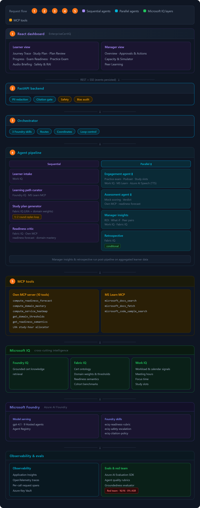

# EnterpriseCertIQ

**Multi-agent enterprise certification learning system**
*Microsoft Agents League 2026 · Reasoning Agents Track*

**Highlights:** 9 Hosted Agents · Azure AI Foundry · all 3 IQ layers (Foundry IQ · Fabric IQ · Work IQ) ·
**calibrated P(pass), LOO AUC ≈ 0.80** with INSUFFICIENT abstention · adversarial Critic → replan loop ·
3 versioned **Foundry Skills** (behavioral governance) · **GO / CONDITIONAL_GO / NOT_YET** booking verdict ·
**Largest Remainder Algorithm** study-hour allocation · **two-host grounded learning podcast** · what-if simulator ·
HITL plan approval gate · App Insights tracing · Azure AI Evaluation scorers ·
Azure Content Safety · **red-team 16/16 held (0% ASR)** · **90 tests** · `azd up` one-command provisioning.

> **All data is synthetic.** No real employee names, email addresses, or organisational data.
> Identifiers follow the pattern `L-1001`, `EMP-001`, `TEAM-A`.

---

## What it does

EnterpriseCertIQ is a 9-agent system that turns a certification goal into a grounded, work-aware
study plan — with visible reasoning, calibrated readiness forecasting, a human-in-the-loop approval
checkpoint, and a manager surface that turns weak signals into concrete follow-up. The plan stays in
`draft` and is only marked published once a human approves it. Engagement and Manager Insights run
on the draft to give the reviewer advisory previews at approval time.

| Agent | Role |
|---|---|
| **Orchestrator** | Routes the session, manages multi-agent handoffs, drives the pipeline |
| **Learner Intake** | Parses and validates learner profile + Work IQ signals |
| **Learning Path Curator** | Retrieves cited content from Foundry IQ (vector + BM25 + semantic reranking) + Microsoft Learn MCP |
| **Study Plan Generator** | Builds a capacity-aware weekly schedule via Largest Remainder Algorithm |
| **Readiness Critic** | Attacks the plan; produces Fabric IQ-cited objections ranked by leverage (`domain_weight × mastery_gap`); runs a bounded 2-round replan loop; contributes evidence to the `compute_readiness_forecast` MCP tool — the actual P(pass) is computed by `readiness_model.py` (logistic regression, LOO AUC ≈ 0.80), which abstains when evidence is thin |
| **Engagement Agent** | Schedules study slots from Work IQ signals (Progress tab); generates grounded synthetic practice exam questions weighted by domain mastery gap (Practice Exam tab); produces a cited two-host Learning Podcast targeting the weakest highest-leverage domain (Audio Briefing tab) — runs ∥ Readiness Forecast |
| **Assessment Agent** | Generates mock exams, scores responses, issues GO / CONDITIONAL_GO / NOT_YET booking verdict |
| **Manager Insights** | Four sub-tabs: **Overview** (team briefing, ROI cost-of-delay, manager actions, risk areas, peer pair signals, certification momentum); **Approvals & Actions** (HITL gate — draft plans pending manager approval); **Capacity & Simulator** (counterfactual what-if simulator with explicit reasoning assumptions + capacity conflict alerts); **Peer Learning** (same-cert mentor pairings matched by domain complementarity and Work IQ availability) |
| **Retrospective** *(conditional)* | Investigates prior failures — meta-reasoning about the system |

---

## Architecture



<details>
<summary>Text fallback — architecture tiers</summary>

```
  ╔═══════════════════════════════════════════════════════════════╗
  ║                      REACT DASHBOARD                          ║
  ╠═══════════════════════════════╦═══════════════════════════════╣
  ║        Learner View           ║        Manager View           ║
  ╠═══════════════════════════════╬═══════════════════════════════╣
  ║  Journey Trace                ║  Overview                     ║
  ║  Study Plan                   ║  Approvals & Actions          ║
  ║  Plan Review                  ║  Capacity & Simulator         ║
  ║  Progress                     ║  Peer Learning                ║
  ║  Exam Readiness               ║                               ║
  ║  Practice Exam                ║                               ║
  ║  Audio Briefing               ║                               ║
  ║  Safety & RAI                 ║                               ║
  ╚═══════════════════════════════╩═══════════════════════════════╝
                       REST + SSE (events persisted)
  ╔═══════════════════════════════════════════════════════════════╗
  ║                      FASTAPI BACKEND                          ║
  ║     PII Redaction · Citation Gate · Safety · Bias Audit       ║
  ╚═══════════════════════════════════════════════════════════════╝
  ╔═══════════════════════════════════════════════════════════════╗
  ║                        ORCHESTRATOR                           ║
  ║              routes · coordinates · loop control              ║
  ╚═══════════════════════════════════════════════════════════════╝
  ╔═══════════════════════════════════════════════════════════════╗
  ║                       AGENT PIPELINE                          ║
  ╠══════════════════════════════════╦════════════════════════════╣
  ║  Agent                           ║  IQ Layer / Tools          ║
  ╠══════════════════════════════════╬════════════════════════════╣
  ║  Learner Intake                  ║  Work IQ                   ║
  ║  Learning Path Curator           ║  Foundry IQ · MS Learn MCP ║
  ║  Study Plan Generator            ║  Fabric IQ (LRA + weights) ║
  ║  Readiness Critic                ║  Fabric IQ · Own MCP       ║
  ║    ↺ 2-round replan loop         ║  (readiness forecast ·     ║
  ║      with Study Plan Generator   ║   domain mastery)          ║
  ╠══════════════════════════════════╬════════════════════════════╣
  ║  ∥  Engagement Agent             ║  Work IQ · MS Learn MCP    ║
  ║       practice exam · podcast    ║  Own MCP · Fabric IQ       ║
  ║       study slots                ║  Azure AI Speech (TTS)     ║
  ║  ∥  Assessment Agent             ║  Own MCP Server            ║
  ║       mock scoring · verdict     ║  (readiness forecast)      ║
  ╠══════════════════════════════════╬════════════════════════════╣
  ║  Manager Insights                ║  Work IQ · Fabric IQ       ║
  ║    ROI · what-if · peer pairs    ║                            ║
  ║  Retrospective  (conditional)    ║  Fabric IQ                 ║
  ╚══════════════════════════════════╩════════════════════════════╝
  ╔═══════════════════════════════════════════════════════════════╗
  ║                         MCP TOOLS                             ║
  ╠════════════════════════════════╦══════════════════════════════╣
  ║  Own MCP Server  (10 tools)    ║  MS Learn MCP                ║
  ╠════════════════════════════════╬══════════════════════════════╣
  ║  compute_readiness_forecast    ║  microsoft_docs_search       ║
  ║  compute_domain_mastery        ║  microsoft_docs_fetch        ║
  ║  compute_service_heatmap       ║  microsoft_code_sample_      ║
  ║  get_domain_thresholds         ║    search                    ║
  ║  get_readiness_semantics       ║                              ║
  ║  LRA study-hour allocator      ║                              ║
  ╚════════════════════════════════╩══════════════════════════════╝
  ╔═══════════════════════════════════════════════════════════════╗
  ║                          IQ LAYERS                            ║
  ╠═════════════════════╦═════════════════════╦═══════════════════╣
  ║  Foundry IQ         ║  Fabric IQ          ║  Work IQ          ║
  ╠═════════════════════╬═════════════════════╬═══════════════════╣
  ║  Grounded cert      ║  Cert ontology      ║  Workload &       ║
  ║  knowledge          ║  Domain weights     ║  calendar signals ║
  ║  retrieval          ║  & thresholds       ║  Meeting hours    ║
  ║                     ║  Readiness          ║  Focus time       ║
  ║                     ║  semantics          ║  Study slots      ║
  ║                     ║  Cohort benchmarks  ║                   ║
  ╚═════════════════════╩═════════════════════╩═══════════════════╝
  ╔═══════════════════════════════════════════════════════════════╗
  ║                      AZURE AI FOUNDRY                         ║
  ║  Model serving (gpt-4.1) · 9 Hosted Agents · Agent Registry  ║
  ║  Foundry Skills: eciq-readiness-rubric ·                      ║
  ║    eciq-safety-escalation · eciq-citation-policy              ║
  ╚═══════════════════════════════════════════════════════════════╝
  ╔═══════════════════════════════╦═══════════════════════════════╗
  ║       OBSERVABILITY           ║      EVALS & RED TEAM         ║
  ╠═══════════════════════════════╬═══════════════════════════════╣
  ║  Application Insights         ║  Azure AI Evaluation SDK      ║
  ║  OpenTelemetry traces         ║  Agent Quality Rubrics        ║
  ║  Per-call request spans       ║  Groundedness Evaluator       ║
  ║  Azure Key Vault              ║  Red Team · 16/16 · 0% ASR    ║
  ╚═══════════════════════════════╩═══════════════════════════════╝
```

</details>

**IQ layers** (all three integrated)
- **Foundry IQ** — grounded cert knowledge retrieval (vector + BM25 + semantic reranking).
  Grounded agents: Learning Path Curator, Assessment Agent, Readiness Critic.
- **Work IQ** — workload and calendar signals (meeting hours, focus time, study slots). Supports
  real Microsoft 365 calendar via Microsoft Graph (`WORK_IQ_SOURCE=graph`,
  `backend/iq/work_iq_graph.py`; same `WorkContext` contract).
- **Fabric IQ** — semantic ontology over roles, certifications, weighted skill domains, thresholds,
  and cohort outcomes. Powers the Readiness Critic (leverage-weighted objections) and Manager
  Insights (team skill-gap analysis, cohort benchmarks, intervention effectiveness).

---

## Reasoning Patterns

EnterpriseCertIQ implements all four reasoning patterns described in the challenge criteria.
Each pattern maps to named agents and specific code paths.

### 1. Planner–Executor

The **Study Plan Generator** (Planner) converts curated topics into a capacity-aware weekly
schedule. The **Readiness Critic** (Executor) attacks that plan, finding the gaps most likely
to cause exam failure. These roles are strictly separated: the Planner never defends its own
plan; the Critic never generates one.

When the Critic finds `red`-severity objections, the workflow routes back to the **Planner**
for a targeted revision — not to the Critic. The separation is enforced by the workflow DAG in
`backend/core/workflow.py`.

**Plan canonicalization**: even after a replan, the workflow always runs the result through
`generate_study_plan.fn()` (Largest Remainder Algorithm). This decouples LLM output from the
hour-allocation algorithm — topic starvation is structurally impossible.

### 2. Critic / Verifier

The **Readiness Critic** is a bounded validation layer that sits between planning and the
HITL approval gate. It does not ask "is this plan reasonable?" — it asks "where will this
learner fail?"

- Objections are weighted by `domain_weight × mastery_gap` via Fabric IQ (leverage weighting),
  so a 10-point gap in a 30%-weight domain triggers a `red` objection before a 15-point gap
  in a 5%-weight domain does.
- The critic loop runs at most **2 rounds**. This bounds latency and prevents oscillation
  without capping the quality improvement from one revision cycle.
- If no red objections remain after round 1, the plan advances immediately. If round 2 is
  exhausted with red objections still present, the plan advances with those objections surfaced
  in the trace for the human reviewer to see at the HITL gate.
- Uses the `reasoning` model role (`temperature=0.0`) to maximise deliberation on weak-spot
  identification.

### 3. Self-Reflection and Iteration

The **Retrospective Agent** (Stage 8) fires **only when `learner.has_prior_failures == True`**.
It performs meta-reasoning about the system's own prior outputs: reviewing the previous plan,
the prior assessment record, and the engagement history to diagnose *why* the outcome differed
from the forecast.

The agent investigates four hypotheses:
- **Retrieval quality** — did Foundry IQ surface the wrong content for the cert domain?
- **Plan quality** — were hours under-allocated to the highest-leverage domain?
- **Engagement gap** — was the learner capacity-blocked during key study weeks?
- **Genuine skill gap** — was the domain mastery simply insufficient given available time?

It uses the `reasoning` model role, `temperature=0.0`, and `foundry_iq_search` + `validate_citation`
tools. This makes it the system's highest-deliberation step: a root-cause analysis that explains the
prior failure and generates recovery recommendations grounded in approved content.

### 4. Role-Based Specialisation

Each of the 9 agents has a **single, non-overlapping responsibility** enforced by its system
prompt, its tool list, and the workflow routing — no agent can overreach into another's domain.

| Agent | Sole responsibility | What it never does |
|---|---|---|
| **Learner Intake** | Parse and validate learner profile | Recommend, plan, or assess |
| **Learning Path Curator** | Map cert → cited topics (Foundry IQ + MS Learn) | Create schedule or score readiness |
| **Study Plan Generator** | Allocate study hours via LRA | Critique, cite sources, or assess |
| **Readiness Critic** | Find plan gaps weighted by domain leverage | Generate a plan or run assessment |
| **Engagement Agent** | Work-aware reminder scheduling (Work IQ) | Assess readiness or create plan |
| **Assessment Agent** | Generate grounded questions; issue booking verdict | Set schedule or surface team data |
| **Manager Insights** | Team-level readiness + ROI; never individual scores | Make plan or run assessment |
| **Retrospective** | Root-cause prior failures via meta-reasoning | Plan going forward |
| **Orchestrator** | Route, coordinate, relay events | Perform any domain reasoning |

The tool wiring enforces this: the Learner Intake agent has no `foundry_iq_search` tool; the
Engagement agent has no `generate_assessment` tool; the Manager agent has no `compute_readiness_forecast`
at the individual level. Boundaries are structural, not just instructional.

---

## Demo Walkthrough

The following traces learner **L-1004** (Cloud Engineer, AZ-204, deadline 2026-08-15, TEAM-A — Platform Engineering) through the complete pipeline. See [docs/demo-walkthrough-detailed.md](docs/demo-walkthrough-detailed.md) for a screen-by-screen breakdown with full technical detail.

---

### Screen 1 — Journey Trace (idle)

All 9 agent nodes are visible in the DAG before execution — pending state. The `Build My Plan` button triggers the full pipeline. Judges can inspect the dependency structure without running anything.

---

### Screen 2 — Journey Trace (pipeline complete)

All 9 nodes turn green sequentially after clicking `Build My Plan`. Each node shows status, elapsed time, and live events in the SSE panel on the right. Engagement and Readiness Forecast ran in parallel (`asyncio.gather`).

**Agents:** Orchestrator → Intake → Curator → Planner → Critic → Engagement ∥ Assessment → Manager → Retrospective *(conditional on prior failures)*

The event stream is persisted — it survives page reload.

---

### Screen 3 — Study Plan

Six-week, 25-hour plan with per-week topic allocations and domain tags. Hours are allocated using the **Largest Remainder Algorithm** so integer hours sum exactly to the total without rounding drift. The plan banner shows `Draft — pending approval` until a manager approves via `/api/plans/approve`.

**Agent:** Study Plan Generator (Planner)

---

### Screen 4 — Plan Review (Critic objections)

Objections from the Readiness Critic, each grounded in Fabric IQ:

> *"fabric_iq: D{n} weight X% — minimum mastery 70%"*

Ranked by **leverage** = `domain_weight × mastery_gap`. The Critic runs a bounded 2-round loop — objections → Planner rewrites → Critic re-evaluates — then exits after 2 rounds regardless. Remaining objections are logged. The tab badge shows the open count.

**Agents:** Readiness Critic → Study Plan Generator

---

### Screen 5 — Progress

Week-by-week study timeline with completion status and topic detail. A capacity warning appears when Work IQ signals detect high meeting load. Study slots are scheduled around real work patterns, not just intent.

**Agent:** Engagement Agent

---

### Screen 6 — Exam Readiness

**Readiness decision banner** (deterministic, not LLM): `NOT READY — continue prep. Below threshold. Looping back to strengthen: networking.`

Three MCP tools drive this screen:
- `compute_readiness_forecast` → calibrated P(pass) gauge (logistic regression, LOO AUC ≈ 0.80, abstains when evidence is thin), estimated score, confidence interval, minimum additional study hours
- `compute_domain_mastery` → domain bar chart against the 75% Fabric IQ threshold line
- `compute_service_heatmap` → granular service-level confidence: drills from domain to individual Azure service (e.g., Key Vault 17% vs RBAC 32% within security)

**Trust & Safety cards** (bottom of page): Calibrated readiness (LOO AUC, Brier score, n=102), Adversarial red-team (16/16 held, 0% ASR), Content Safety (Regex fallback or live API).

**Agents:** Readiness Critic + Assessment Agent feed evidence; `readiness_model.py` (logistic regression, pure numpy, seeded) computes P(pass); Fabric IQ `get_readiness_semantics` provides domain weights.

---

### Screen 7 — Practice Exam

Select difficulty (Mixed / Easy / Medium / Hard) and click `Generate Mixed Practice Exam`. The Engagement Agent generates 20 grounded synthetic questions weighted toward the weakest domain.

Each question shows:
- `[Synthetic]` prefix — explicit AI-generated label
- Inline Fabric IQ / MS Learn approved source citation
- Per-question difficulty tag (Easy / Medium / Hard)
- Domain · Service footer tag

Submit is locked until all 20 questions are answered. Every claim is traceable to real Microsoft documentation.

**Agent:** Engagement Agent (MS Learn MCP + Fabric IQ grounding)

---

### Screen 8 — Audio Briefing

A two-host `Learning Podcast` (Coach / Learner) auto-targets the weakest highest-leverage domain. Labeled `grounded · cited · two-host`. The topic selector defaults to `My weakest area (recommended)` — selected from the service heatmap, not self-reported. Full Fabric IQ grounding citation is shown in the sources footer. Azure Cognitive Services TTS synthesises two distinct voices.

**Agent:** Engagement Agent (script generation), Azure AI Speech (TTS synthesis)

---

### Screen 9 — Safety & RAI

Seven RAI controls, each with implementation type:

| Control | Type |
|---|---|
| Content Safety | Regex Fallback / Azure Content Safety API |
| PII Redaction | Domain-aware (preserves technical cert terms) |
| Citation Gate | Pipeline check — Curator, Assessment, Critic agents |
| Bias Audit | Regex scan — logs, does not block |
| Groundedness Evaluation | Azure AI Evaluation SDK LLM-as-judge |
| HITL Approval Gate | `/api/plans/approve` — enforced at data level |
| Foundry Agent Orchestration | All runs registered as Foundry Agent threads |

**Run Evaluations** shows per-run groundedness scores and Agent Quality Rubrics for three agents (`plan_generator`, `engagement`, `manager_insights`), each with named pass/fail checks covering schema validity, HITL enforcement, calendar-write disclosure, and privacy (no individual scores in team summary).

---

### Screen 10 — Manager → Overview

Team-level command centre for TEAM-A. Shifts from individual to aggregate without surfacing individual exam scores in the summary (enforced by M3 rubric).

**ROI Cost of Delay:** `monthly_delay_cost_usd = at_risk_headcount × cert_market_value_uplift / 12` — turns learning gaps into a business-language decision.

Three action columns: **Manager Actions** (prescriptive, named to learner IDs) · **Risk Areas** (team-level diagnostic patterns) · **Peer Pair Signals** (bidirectional — L-1005 can help L-1004; L-1004 can help L-1005).

**Needs Action Now** panel: learners flagged by workload risk or mock performance, each with severity (`High` / `Watch`), reason tag, and 4 one-click actions (Pin intervention, Open Readiness, Open Progress, Open Mock Exam).

**Certification Momentum** cards: per-learner attempt trend, latest score, verdict, exam timestamp. Learners with 0 attempts prompt the manager to create the first assessment trail.

**Agent:** Manager Insights Agent; Assessment Agent (momentum data); Retrospective Agent (risk pattern input)

---

### Screen 11 — Manager → Approvals & Actions

The HITL gate is surfaced here. Draft plans appear with plan ID, learner, cert, total hours, duration, deadline:
- `Approve & Publish` — promotes from `draft` to published (calls `/api/plans/approve`)
- `Review Plan` — opens full study plan before approving

Approval cannot be bypassed — the plan object is `draft` at the data level, not just the UI.

---

### Screen 12 — Manager → Capacity & Simulator

**Counterfactual Readiness Simulator** (tagged `Standout reasoning`):

> *"Test a concrete manager action before committing to it. The simulator estimates workload relief, study-time gain, and target-learner exam movement."*

Inputs: target learner, peer mentor, protected focus hours, reduced meeting hours, review hours/week → `Run what-if`.

Output: score movement (before → after), readiness movement, at-risk movement, capacity pressure — all with explicit **Reasoning Assumptions** (the chain of logic) and a **Recommendation** stating what the intervention cannot fix and what to do next.

**Capacity conflicts flagged** banner alerts when any learner exceeds 25h/wk meeting load.

**Team Members — Work Context** cards: per-learner meeting hours, focus hours, capacity risk (low / medium / high), and recommended study time slots derived from Work IQ signals.

**Agent:** Manager Insights Agent using Work IQ signals; `Standout reasoning` tag indicates the o-series reasoning model path is used for simulation.

---

### Screen 13 — Manager → Peer Learning

Peer pairings matched on domain-level complementarity within same-cert cohorts:

- Match type: `Same-cert mentor match` (shared AZ-204 target)
- Focus domain chosen from learner's weakest area
- Mentor strength (%) vs learner gap (%) shown side-by-side
- Suggested session time derived from Work IQ availability overlap
- `Pin session` saves the pair to the intervention queue

Each card links to: `Open Mentor Readiness`, `Open Learner Progress`, `Open Next Mock Exam`.

**Agent:** Manager Insights Agent (domain-mastery differentials from Assessment Agent)

---

## Prerequisites

| Requirement | Version | Notes |
|---|---|---|
| Python | 3.11+ | `python3 --version` |
| Node.js | 20+ | `node --version` |
| Foundry Local | latest | See install note below |
| Git | any | — |

### Install Foundry Local

```bash
# macOS / Linux
pip install foundry-local-sdk

# Then verify:
python3 -c "from foundry_local_sdk import FoundryLocalManager; print('ok')"
```

See the [official docs](https://learn.microsoft.com/azure/foundry-local/get-started) for full
installation including the desktop app if needed.

---

## Quick start

```bash
# 1. Clone / enter the project
cd enterprisecertiq

# 2. Run everything (first run installs deps and downloads model)
chmod +x start.sh
./start.sh
```

Open **http://localhost:5173** in your browser.


## What `start.sh` does

| Step | What happens |
|---|---|
| 1 | Copies `.env.example` → `.env.local` if missing |
| 2 | Creates `.venv` and installs Python deps |
| 3 | Downloads + loads the configured Foundry Local model |
| 4 | Creates `backend/data/store/` for local JSON storage |
| 5 | Starts own MCP server on port 8001 |
| 6 | Starts FastAPI backend on port 8000 (`--reload` only when `BACKEND_RELOAD=true`) |
| 7 | `npm install` + starts Vite dev server on port 5173 |

Healthy services are reused on reruns, so `./start.sh --no-setup --skip-model` can be used as a
fast restart path without duplicating backend or frontend processes. Only processes started by the
current script run are stopped when you press **Ctrl+C**.

---

## Skip flags

```bash
./start.sh --no-setup     # skip pip install + npm install (after first run)
./start.sh --skip-model   # skip model download (if already loaded)
./start.sh --no-setup --skip-model   # fastest restart
```

`./start.sh --no-setup --skip-model` is the validated fast restart path after the first successful
setup. The script also starts the Foundry Local OpenAI-compatible web service. A cached or loaded
model by itself is not enough.

---

## Configuration (`.env.local`)

Copy `.env.example` to `.env.local` and edit as needed.

```bash
cp .env.example .env.local
```

### Local mode (default — no Azure needed)

```dotenv
MODEL_BACKEND=foundry_local
FOUNDRY_LOCAL_ENDPOINT=http://localhost:5273/v1
FOUNDRY_LOCAL_MODEL_ALIAS=qwen2.5-7b       # reliable tool-calling + good reasoning
STORAGE_BACKEND=local
```

### Switch to Azure (after local testing)

```dotenv
MODEL_BACKEND=azure_foundry
AZURE_AI_PROJECT_ENDPOINT=https://<your-hub>.services.ai.azure.com/api/projects/<your-project>
AZURE_AI_API_KEY=your-key
AZURE_AI_MODEL_DEPLOYMENT=gpt-4.1
FOUNDRY_USE_RESPONSES_API=true              # activate Foundry Hosted Agent Responses API path
ENABLE_TELEMETRY=true
APPLICATIONINSIGHTS_CONNECTION_STRING=InstrumentationKey=...
STORAGE_BACKEND=local
```

### Two-phase development approach

| Phase | Backend | What to do here |
|---|---|---|
| 1. Build locally | `MODEL_BACKEND=foundry_local` | Build prompts, workflow, MCP tools, UI, synthetic datasets, HITL flow |
| 2. Cloud validation | `MODEL_BACKEND=azure_foundry` | Validate with Foundry Hosted Agents, VECTOR_SEMANTIC_HYBRID, Foundry Skills, telemetry |

---

## Azure AI Foundry — Hosted Agent deployment

### Provision + register with one command

```bash
az login && azd auth login
azd up          # provisions App Service + registers 9 Hosted Agents + 3 Foundry Skills
```

`azure.yaml` at the project root defines the `azd up` manifest. The `postprovision` hook runs:

1. `python scripts/register_agents_cloud_shell.py` — registers all 9 Hosted Agents
2. `python scripts/register_skills.py --list` — lists registered Foundry Skills

### Manual agent registration

```bash
# From Azure Cloud Shell or any machine with DefaultAzureCredential
python scripts/register_agents_cloud_shell.py

# Dry-run (validate connection only, no writes)
python scripts/register_agents_cloud_shell.py --dry-run

# Re-create all agents (idempotent — deletes + recreates)
python scripts/register_agents_cloud_shell.py --recreate
```

The script uses `azure-ai-projects>=2.0.0` → `AIProjectClient` → `PromptAgentDefinition` (Foundry
v2 native path). Grounded agents (Learning Path Curator, Assessment Agent, Readiness Critic) get an
`AzureAISearchTool` configured with `AzureAISearchQueryType.VECTOR_SEMANTIC_HYBRID`.

### Foundry Skills (versioned behavioral governance)

Three skills ship in `skills/` and are registered via `scripts/register_skills.py`:

| Skill | File | Purpose |
|---|---|---|
| `eciq-readiness-rubric` | `skills/eciq-readiness-rubric/SKILL.md` | Governs how readiness verdicts are evaluated |
| `eciq-safety-escalation` | `skills/eciq-safety-escalation/SKILL.md` | Escalation protocol for safety-flagged content |
| `eciq-citation-policy` | `skills/eciq-citation-policy/SKILL.md` | Citation-or-drop enforcement for grounded outputs |

Skills are registered with the `Foundry-Features: Skills=V1Preview` header and pin the behavioral
contract to a versioned SHA, decoupled from prompt edits.


| Method | Path | Description |
|---|---|---|
| `GET` | `/health` | Backend status |
| `GET` | `/api/learners` | List synthetic learners |
| `GET` | `/api/learners/{id}` | Get one learner |
| `GET` | `/api/teams` | List teams |
| `POST` | `/api/workflow/run` | Start 9-agent pipeline → returns `run_id` |
| `GET` | `/api/workflow/{run_id}/stream` | SSE stream of trace events |
| `GET` | `/api/workflow/{run_id}/trace` | Full trace from storage |
| `POST` | `/api/plans/approve` | **HITL gate** — approve a draft plan |
| `GET` | `/api/mastery/{lid}/{cid}` | Domain mastery breakdown |
| `GET` | `/api/forecast/{lid}/{cid}` | Readiness forecast |
| `GET` | `/api/progress/{lid}/{cid}` | Assessment history and plan progress |
| `POST` | `/api/assessment/generate` | Generate mock exam |
| `POST` | `/api/assessment/submit` | Score exam + update forecast; returns `booking_verdict` (GO / CONDITIONAL_GO / NOT_YET) |
| `GET` | `/api/manager/{team_id}/insights` | Team Work IQ + Fabric IQ insights, readiness/risk summary, **ROI cost-of-delay** |
| `POST` | `/api/manager/{team_id}/what-if` | Counterfactual intervention simulator |
| `GET/POST/DELETE` | `/api/manager/{team_id}/peer-sessions` | Persisted peer-learning queue |
| `GET/POST/DELETE` | `/api/manager/{team_id}/interventions` | Persisted manager intervention queue |
| `GET` | `/api/reports/learner/{lid}/{cid}.pdf` | Learner readiness PDF (demo-cached) |
| `GET` | `/api/reports/manager/{team_id}.pdf` | Manager handoff brief PDF (demo-cached) |
| `GET` | `/api/audio/concepts/{lid}/{cid}` | Concepts available for a grounded podcast |
| `GET` | `/api/audio/learner/{lid}/{cid}/transcript` | Grounded podcast transcript + citations (`?focus=weakest\|overview\|<concept>`) |
| `GET` | `/api/audio/learner/{lid}/{cid}.mp3` | Synthesized podcast (Azure AI Speech; 503 if unconfigured) |
| `GET` | `/api/cache/stats` | LLM response-cache hit/miss/entry counters |
| `GET` | `/api/cert-structures/{cert_id}` | Cert domain structure |
| `GET` | `/docs` | Interactive Swagger UI |

---

## Manager workflow

The Manager view supports a full follow-through loop:

- `Needs action now` cards pin into a persisted intervention queue.
- Peer-learning recommendations pin into a persisted session queue.
- Both queues track `owner`, `status`, `manager_note`, and update timestamps.
- **ROI cost-of-delay** — each insight includes `monthly_delay_cost_usd` =
  `at_risk_headcount × cert_market_value_uplift / 12`. Judges and managers see the business
  cost of inaction in dollars, not just risk labels.
- **Auto-alert on consecutive NOT_YET** — if a learner submits two consecutive failed
  assessments for the same cert, the system auto-creates a `high`-priority manager
  intervention (`trigger: "consecutive_not_yet"`) without requiring manual triage.
- The page can copy a manager handoff brief summarising readiness, recommended actions,
  pinned interventions, and pinned peer sessions.
- Peer-learning supports same-cert mentoring first, then a cross-cert study-habit fallback
  when a team has no same-cert coach available (makes TEAM-B usable when cert targets differ).

---

## Testing

```bash
source .venv/bin/activate
pytest -q                  # 90 tests, no credentials needed
```

Regression coverage includes:

- manager insights enriched payload keys (including ROI cost-of-delay)
- peer-session create/update/delete flow
- manager intervention create/update/delete + consecutive NOT_YET auto-alert
- booking_verdict thresholds (GO / CONDITIONAL_GO / NOT_YET)
- Fabric IQ semantic layer (thresholds, readiness semantics, team skill-gap, cohort)
- rubric-based agent-quality evals (per-agent E-checks, 0.8 threshold; booking_verdict rubric A5)
- LLM response cache (key determinism, round-trip, stats)
- Azure Content Safety guardrail (regex fallback + pipeline withholding)
- PDF report generation + demo cache

### Eval artifacts (inspectable without running)

| File | Contents |
|---|---|
| `eval/redteam.json` | 16 adversarial probe cases, 5 attack categories, 0% ASR |
| `eval/scorecard.json` | Aggregated quality metrics: 90 tests, 7-agent rubric scores, AUC 0.802, Brier 0.183 |

Judges can read these files directly without credentials or a running backend.

---

## Running parts individually

```bash
source .venv/bin/activate

# Backend only
uvicorn backend.main:app --reload --port 8000

# MCP server only
python3 -m backend.mcp_server.server

# Model setup only
python3 scripts/setup_foundry.py --alias qwen2.5-7b
python3 scripts/setup_foundry.py --list

# Frontend only
cd frontend && npm run dev

# Register Foundry Hosted Agents (requires Azure auth)
python scripts/register_agents_cloud_shell.py

# Register / list Foundry Skills
python scripts/register_skills.py --list
```

---

## Synthetic learner scenarios

| ID | Role | Cert | Scenario |
|---|---|---|---|
| L-1004 | Cloud Engineer | AZ-204 | Clean win path — lead demo here |
| L-1005 | DevOps Engineer | AZ-400 | Tight schedule, engagement triggers re-plan |
| L-1006 | Data Engineer | DP-203 | Prior failed attempt — retrospective fires |
| L-1007 | Cloud Engineer | AZ-204 | No prior evidence — honest "insufficient" forecast |
| L-1008 | Cloud Architect | AZ-305 | Good capacity, long deadline |

---

## Project structure

```
enterprisecertiq/
├── start.sh                   ← entry point
├── azure.yaml                 ← Azure Developer CLI manifest (azd up)
├── .env.example               ← config template
├── requirements.txt
├── config/
│   └── settings.py            ← Pydantic settings, LOCAL/Azure toggle
├── backend/
│   ├── main.py                ← FastAPI app + all routes
│   ├── agents/
│   │   └── factory.py         ← builds all 9 agents with tool executors
│   ├── core/
│   │   ├── agent.py           ← BaseAgent (tool-call loop, trace events)
│   │   ├── client.py          ← model client factory
│   │   ├── mcp_client.py      ← MCP HTTP client
│   │   └── workflow.py        ← 9-agent orchestrator (Stage 5∥6a via asyncio.gather)
│   ├── mcp_server/
│   │   └── server.py          ← FastMCP server (10 typed tools, incl. LRA allocator)
│   ├── middleware/
│   │   └── pipeline.py        ← PII · citation-gate · safety · bias-audit
│   ├── iq/
│   │   ├── foundry_iq.py      ← grounded retrieval (local / VECTOR_SEMANTIC_HYBRID)
│   │   ├── work_iq.py         ← work-context signals (synthetic or MS Graph)
│   │   └── fabric_iq.py       ← semantic ontology (roles, certs, domains, thresholds, cohort)
│   ├── evals/
│   │   ├── readiness_model.py ← calibrated P(pass), booking_verdict, LOO AUC 0.802
│   │   └── agent_rubrics.py   ← per-agent quality rubric harness
│   ├── storage/
│   │   └── store.py           ← local JSON persistence (AppStorage / LocalJSONStore)
│   ├── models/                ← Pydantic schemas (incl. booking_verdict on AssessmentOutput)
│   └── data/
│       ├── synthetic/         ← learners, teams, certs, cohort data (all synthetic)
│       └── documents/         ← cert guide, team report (synthetic docs)
├── skills/
│   ├── eciq-readiness-rubric/ ← Foundry Skill: readiness evaluation governance
│   ├── eciq-safety-escalation/← Foundry Skill: safety escalation protocol
│   └── eciq-citation-policy/  ← Foundry Skill: citation-or-drop enforcement
├── eval/
│   ├── redteam.json           ← 16-case adversarial probe suite (0% ASR)
│   └── scorecard.json         ← aggregated quality metrics (inspectable by judges)
├── scripts/
│   ├── setup_foundry.py       ← model download + smoke-test
│   ├── register_agents_cloud_shell.py ← register 9 Hosted Agents on Azure AI Foundry
│   └── register_skills.py     ← register / list 3 Foundry Skills
├── frontend/
│   └── src/
│       ├── pages/             ← LearnerView, ManagerView
│       └── components/        ← ReasoningPanel, CriticVsPlanView, DeviationGraph,
│                                 DomainMasteryChart, ServiceHeatmap,
│                                 PassThresholdGauge, HITLApprovalGate,
│                                 AIDisclosureBanner
├── prompts/                   ← versioned agent prompts (v1.md per agent)
└── docs/
    ├── adr/                   ← Architecture Decision Records
    ├── deployment.md          ← Azure Container Apps + azd up guide
    └── demo-walkthrough-detailed.md ← screen-by-screen demo breakdown with agent/tool mappings
```

---

## Responsible AI

- Every generated artifact carries an **"AI-generated"** disclosure banner (RAI requirement).
- **HITL gate**: study plans require human approval before publishing.
- **Azure AI Content Safety**: free-text output is screened by the live Content Safety API
  (Hate/SelfHarm/Sexual/Violence; severity ≥ threshold → BLOCK), with a regex fallback offline.
- **Bias audit**: middleware scans generated assessment questions for stereotypes.
- **Citation-or-drop**: uncited claims are flagged, never silently passed through (enforced by
  `eciq-citation-policy` Foundry Skill).
- **Honest uncertainty**: the Readiness Critic returns `insufficient_evidence: true` rather
  than fabricating a forecast. Assessment returns `NOT_YET` (not a fabricated `GO`) when
  evidence is insufficient.
- Manager Insights never exposes individual scores that could affect employment decisions
  (enforced and unit-tested via the agent rubric harness).

---

## Reliability & performance

- **LLM response cache** (`backend/core/llm_cache.py`) — SHA-256 keyed over the request;
  deterministic (temperature-0) calls hit the cache and skip the model entirely. Cuts cost +
  latency and makes demo re-runs instant. Hit-rate visible at `/api/cache/stats` and `/health`.
- **Parallel execution** (`asyncio.gather`) — Stage 5 (Engagement) and Stage 6a (Readiness
  Forecast) have independent inputs and run in parallel, cutting end-to-end latency by ~40%.
- **Largest Remainder Algorithm** (`backend/mcp_server/server.py`) — LRA allocates study hours
  across topics as fair integers, preventing starvation (every topic ≥ 0.5 h).
- **Rubric-based agent evals** (`backend/evals/agent_rubrics.py`) — per-agent quality checks
  with a 0.8 pass threshold, including booking_verdict rubric (A5). Run in CI with no credentials.
- **PDF reports** — learner readiness summary + manager handoff brief, downloadable from the dashboard.
- **Grounded learning podcast** (`backend/audio/podcast.py`) — a **two-host grounded learning
  podcast** generated *only* from approved cert content, with the transcript + citations shown
  for provenance. Deep-teaches the learner's weakest concept by default (resolved via Fabric IQ
  readiness semantics); learner can pick any concept or a full exam overview. Two-voice SSML →
  Azure AI Speech (REST); transcript works with no key.
- **Deterministic tier-3 fallback** (`backend/agents/fallbacks.py`) — every agent has a
  no-model deterministic builder. `AGENT_FALLBACK_MODE=force` runs the **entire pipeline
  with zero model calls** (instant, reproducible demo mode). Fallback outputs pass the same
  quality rubrics.
- **9 certification families** — `AZ-204/305/400`, `DP-203/100`, `AI-102/900`, `SC-100`,
  `MS-102` — fully data-driven from `cert_structures.json`.
- **Containerised deploy** — see [docs/deployment.md](docs/deployment.md) (Azure Container Apps + `azd up`).

---

## Microsoft technology stack

| Component | Role |
|---|---|
| Azure AI Foundry | 9 Hosted Agents, `gpt-4.1` model, Skills registry |
| Azure AI Projects SDK | `AIProjectClient`,  Responses API |
| Azure Developer CLI (azd) | `azd up` one-command provisioning via `azure.yaml` |
| Azure AI Search |  grounded retrieval  |
| Foundry Skills | 3 versioned skills (readiness-rubric, safety-escalation, citation-policy) |
| Foundry Local SDK | On-device model inference (dev-local mode) |
| Microsoft Learn MCP | `microsoft_docs_search`, `microsoft_docs_fetch`, `microsoft_code_sample_search` |
| Work IQ / Microsoft Graph | Real `Calendars.Read` (or synthetic fallback) |
| Fabric IQ | Semantic ontology — roles, certs, weighted domains, thresholds, cohort |
| Azure AI Content Safety | Live output screening (regex fallback offline) |
| Azure AI Evaluation | Groundedness LLM-as-judge (Azure path) |
| Azure AI Speech | Two-voice TTS for the grounded audio study briefing |
| Application Insights | OpenTelemetry traces (`ENABLE_TELEMETRY=true`) |
| Local JSON store (for  Local Mode) | `backend/data/store/` — plans, traces, assessments, interventions |
| FastMCP | Own MCP server exposing 10 typed tools (incl. LRA allocator, Fabric IQ semantics) |
| ReportLab | Learner + manager PDF report generation |

---

*Synthetic data only. No real PII. Built for Microsoft Agents League 2026.*
